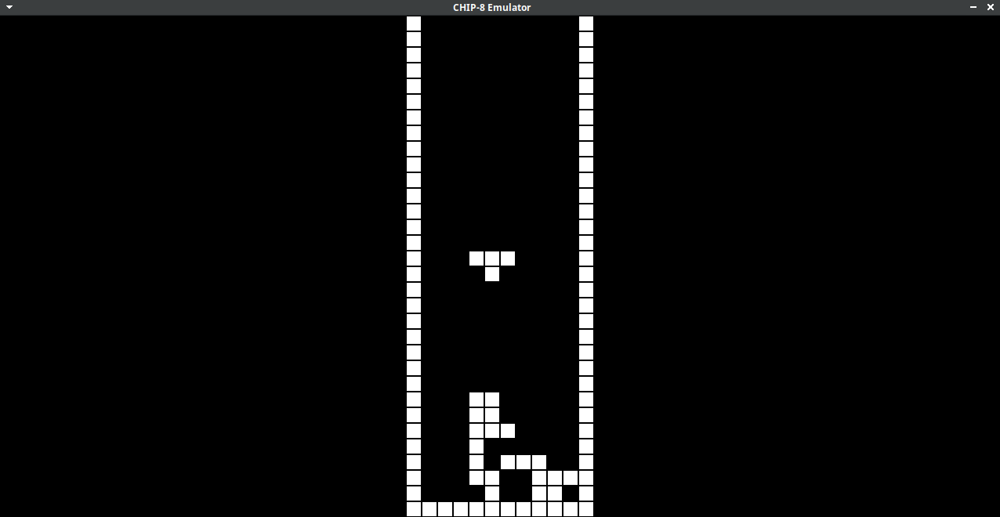

# CHIP 8
A chip8 emulator/interpreter written in C.




## Dependencies
- GCC
- make
- SDL2

## Installation
```bash
git clone https://github.com/suryapsp/chip8
cd chip8
mkdir bin
make
```
<!-- - use ```make debug``` instead of make for debug output -->

## Usage
```bash
./bin/chip8 ./roms/<name-of-the-rom>
```

### Keypad
```
Original CHIP-8 Keyboard Layout

1 2 3 C 			1 2 3 4
4 5 6 D				Q W E R
7 8 9 E				A S D F
A 0 B F				Z X C V

Extra Keys

PAUSE = SPACE
QUIT  = ESCAPE
RESET = BACKSPACE
```

## Future Plans

- write my own chip8 rom
- super chip8 extension
- cli flags

